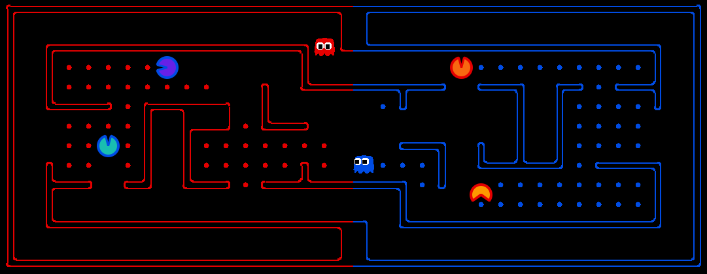

# Pacman_AI_Agents

The purpose of this project is to implement an autonomous agent that can play the game PACMAN Capture the Flag and compete in the UoM COMP90054-2023 Pacman competition:
Here is the rules of the [PACMAN Capture the Flag game](http://ai.berkeley.edu/contest.html).

# Table of Contents
- [AI Method One: A* Heuristic Search](#A-Star-Heuristic-Search)
  * [Motivation](#motivation)
  * [Application](#application)
  * [Trade-offs](#trade-offs)
    - [Advantages](#advantages)
    - [Disadvantages](#disadvantages)
- [AI Method Two: PDDL Classic Planning](#PDDL-Classic-Planning)
  * [Motivation](#motivation)
  * [Application](#application)
  * [Trade-offs](#trade-offs)
    - [Advantages](#advantages)
    - [Disadvantages](#disadvantages)

# A Star Heuristic Search

## Motivation  

The goal is to design two types agents. One is the offensive agent  responsible for attacking, eating as many foods as possible and bringing them back to the border. The other is the defensive agent responsible for chasing the enemy agent and making them back to the start. The goal position is determined by designing and selecting different strategies and then a planning solution is generated by using  A* algorithm.

## Application

### 1. States and Heuristic functions

For the offensive agent, the goal state is the closest boundary position or capsule position. The goal state can also be the closest opponent or a defensive food position.

The offensive agent's heuristic function is designed to assign a value of 9999 to paths that have enemies when there are enemies within 2 Manhattan distance. This allows the agent to avoid being eaten.

The defensive agent's heuristic function is the Manhattan distance between the initial state and the goal state. Regardless of dodging the enemy, the agent only needs to catch up with enemies in the shortest number of steps possible.

### 2. Agent Strategies

#### 2.1 Offensive Strategies

The offensive agent begins by eating the capsule and subsequently carrying 5 foods to the closest boundary. It continues this process until all capsules have been consumed, after that it carries the 3 closest of foods to the boundary.

#### 2.2 Defensive Strategies

When the defensive foods are more than half of toal, the agent conducts patrols along the border and chases the enmeies upon detecting them. This continues until the food numbers falls below half, at which point the agent patrols around the remaining food positions and chases the enmeies when encountered.

[Back to top](#table-of-contents)

## Trade-offs  

### *Advantages*  

* A* algorithm is easy to implemented and it can generated a optimal plan, so it's easy for the agent to plan the next action based on the init state and the goal state.
* A* heuristic search with better strategies can improve the performance and the code is relatively easy to implement

### *Disadvantages*

* Performance depends heavily on the design of the heuristic functions, and designing a good heuristic functions is difficult.
* The selection of the goal state's quality heavily depends on the quality of the strategy's design. Consequently, the overall performance of the agent is significantly influenced by the strategy. If the strategy is not optimal, even if the solution provided by the A* heuristic search is optimal, the final performance still is poor.

[Back to top](#table-of-contents)

# PDDL Classic Planning

## Motivation  

The goal is to model the packman game by using of STRIPS method and us ing the FF planer to solve the problems. In this method, the domain files of the offensive and defensive agent are implemented separately to describe the action of agents. By selecting of different strategies to decided the goal, the problem files are created based on it. Finally the next action will be executed based on the solution of the FF planer.

[Back to top](#table-of-contents)

## Application

### 1. Domian files

Here are predicates and actions that implemented for agents.

#### 1.1 Offensive Agent

| Predicate        | Description                                |
| ---------------- | ------------------------------------------ |
| at-agent         | Agent's cell location                      |
| at-food          | Food's cell location                       |
| has-ghost        | Indicates if a cell location has a ghost   |
| has-capsule      | Indicates if a cell location has a capsule |
| is-carrying      | Indicates if an agent carries food         |
| connected        | Connects cells                             |
| is-capsule-eaten | Indicates if an agent has eaten a capsule  |

| Action            | Description                                                  |
| ----------------- | ------------------------------------------------------------ |
| move              | Agent can move the location if there is no ghost and wall    |
| move-with-capsule | Agent can move the location even there is ghost when has eatn a capsule |
| eat-food          | Agent can eat a food if there is a food in the location      |
| eat-capsule       | Agent can eat a capsule if there is a capsule in the location |

#### 1.2 Defensive Agent

| Predicate   | Description                                |
| ----------- | ------------------------------------------ |
| at-agent    | Agent's cell location                      |
| at-opponent | Food's cell location                       |
| has-capsule | Indicates if a cell location has a capsule |
| connected   | Connects cells                             |

| Action       | Description                                                  |
| ------------ | ------------------------------------------------------------ |
| move         | Agent can move the location if there is no wall              |
| eat-opponent | Agent can eat the opponent if there is a opponent in the location |

### 2. Agent Strategies

#### 2.1 Offensive Strategies

Offensive agent firstly eat the capsule and carry more than 5 food back to the nearest border until there are no capsules on the map. Once the map is free of capsules, the map is split into 4 blocks, the agent calculate which block that contains the most food and has no opponents. The agent go to that block and carries more than 3 back to the border.

#### 2.2 Defensive Strategies

Defensive agent chases the opponent when it detects it, otherwise it check to see if the defending food has been eaten, and if it has been eaten it means that opponents have appeared at that location, and the agent will go to that location to check.When no opponents are appeared, the agent patrols the block with the most food.

[Back to top](#table-of-contents)

## Trade-offs

### *Advantages*  

*  Most of the code is about the domain file, and the agent code is relatively less and easy to implement. A good domain file can help with features that are difficult to implement with coding, such as better enemy avoidance.

### *Disadvantages*

* The path is planned based on information that is already available and cannot utilize information that may happen. This can be very limiting, resulting in even the optimal solution of the planer solution still performing poorly in certain conditions.
* The performance of agents is more affected by strategies, and different goals chosen through different strategies can seriously affect the performance of agents.

[Back to top](#table-of-contents)